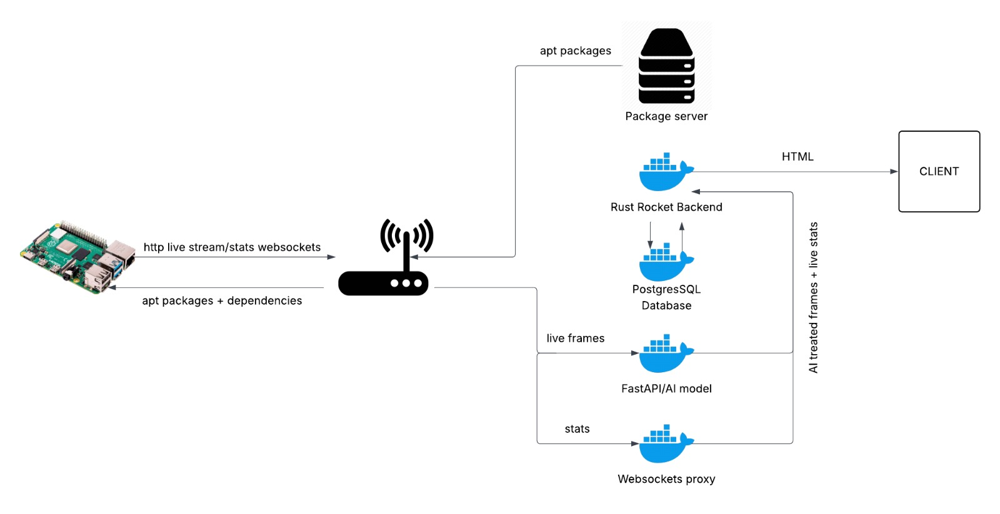

# Raspberry Pi Agent: Real-Time Object Detection System

## Overview
A connected system between Raspberry Pi and backend nodes for real-time image processing. The Pi streams video to backend services which process frames using YOLO object detection, providing secure, optimized live video analysis.

## Key Features
- Real-time object detection (YOLO model)
- Secure MAC-filtered network communication
- Optimized Docker containers (Rust/Python-slim)
- Web dashboard for processed streams
- Automatic service management via systemd

## System Architecture

Components:
1. **Raspberry Pi 4 + Camera** - Image capture
2. **Local Router** - Secure network relay
3. **Backend Services** (Docker):
   - FastAPI/YOLO detection
   - WebSocket proxy
   - PostgreSQL database  
   - Rocket (Rust) backend
4. **Web Client** - Dashboard interface

# Deploy 
cd dashboard_login  
docker compose up 
